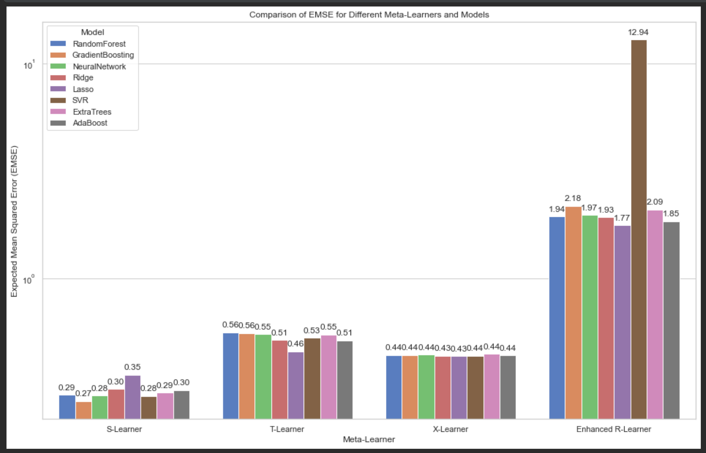
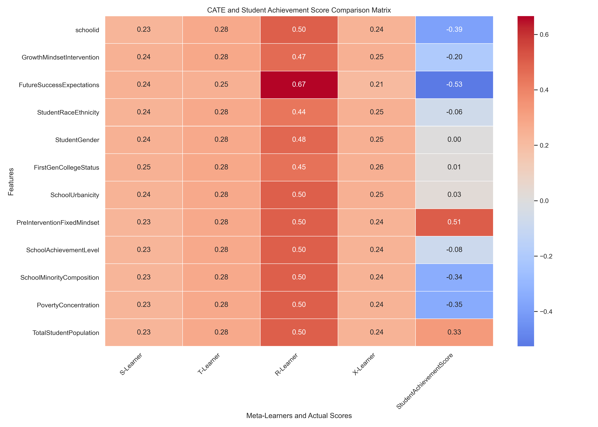
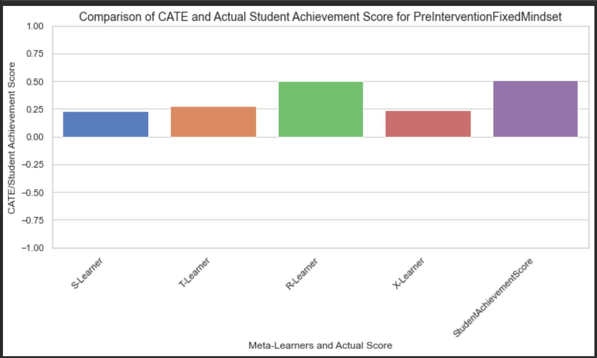
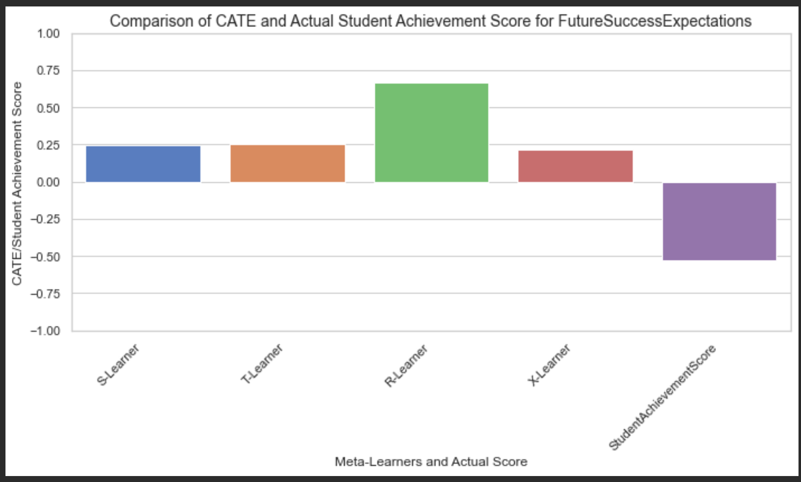
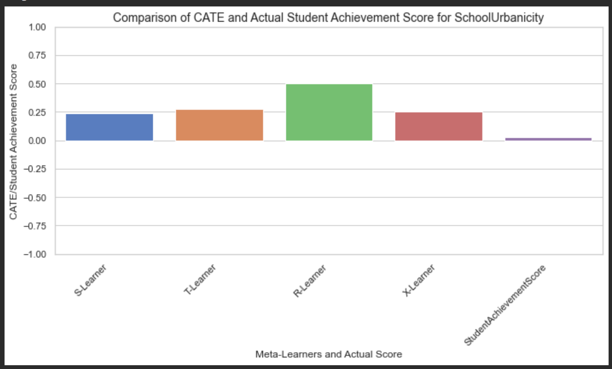
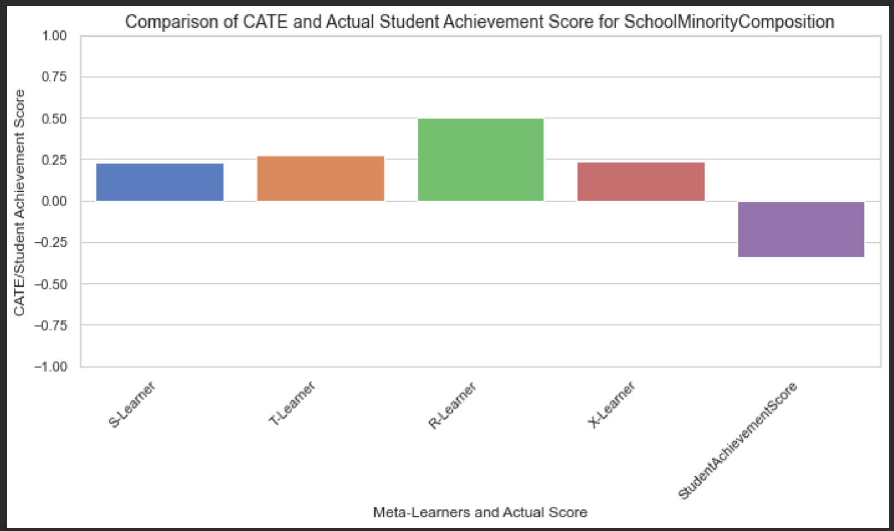
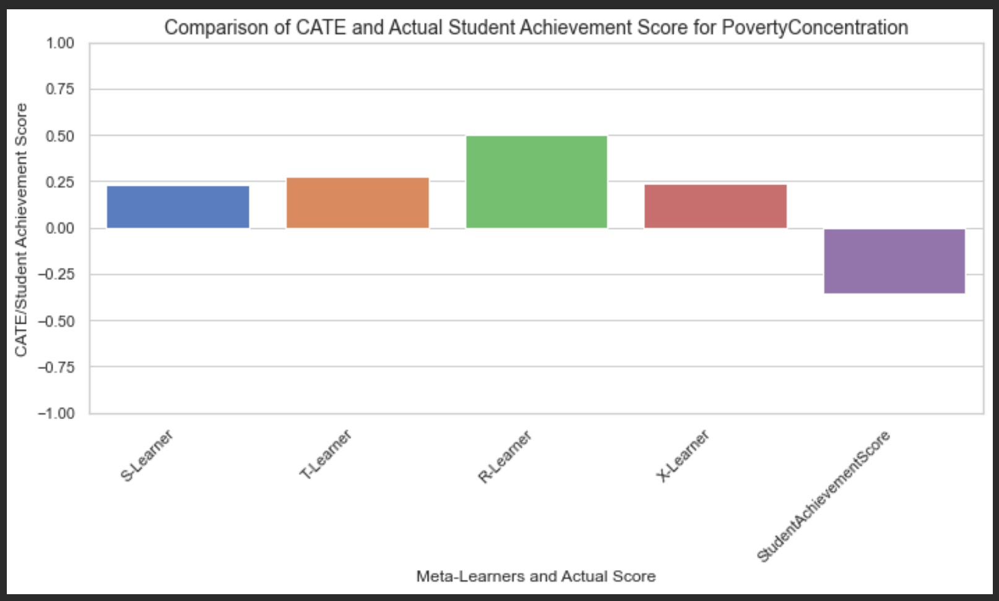

# Project Report: Estimating Conditional Average Treatment Effect (CATE) Using Meta-Learners
## Introduction
In this project, we explore the estimation of the Conditional Average Treatment Effect (CATE) using various meta-learners, specifically focusing on educational interventions. The CATE is a fundamental concept in causal inference, representing the expected treatment effect given a set of covariates. This study leverages observational data from the National Study of Learning Mindsets, aiming to assess how different meta-learning algorithms perform in estimating the treatment effects of a growth mindset intervention on student achievement. The meta-learners explored include the T-Learner, S-Learner, X-Learner, and R-Learner.

## References
1. Künzel et al. (2019): This paper introduces the concept of meta-learners for estimating heterogeneous treatment effects. It forms the foundational framework for the methods implemented in this project.
    * Source: Metalearners for Estimating Heterogeneous Treatment Effects using Machine Learning
    * Authors: Sören R. Künzel, Jasjeet S. Sekhon, Peter J. Bickel, Bin Yu

2. Chernozhukov et al. (2018): This paper discusses double/debiased machine learning methods, which are relevant for understanding the advanced techniques like the R-Learner.

    * Source: Double Machine Learning for Treatment and Causal Parameters
    * Authors: Victor Chernozhukov, Denis Chetverikov, Mert Demirer, Esther Duflo, Christian Hansen, Whitney Newey, James Robins

3. Kuhn & Johnson (2013): This book provides foundational knowledge on data preprocessing techniques used in the experiments.
      * Source: Applied Predictive Modeling
      * Authors: Max Kuhn, Kjell Johnson
## Data Description and Preprocessing
   The dataset used in this project consists of approximately 10,000 students from 76 schools. The key variables include a simulated continuous outcome measure of student achievement (Y) and a binary treatment variable (Z), indicating whether a student received the growth mindset intervention. Additionally, the dataset includes ten covariates, which are split between student-level and school-level variables:

* Student-Level Variables:

    * S3: Students' self-reported expectations for future success, serving as a proxy for prior achievement.
    * C1: Student race/ethnicity (categorical).
    * C2: Student gender (categorical).
    * C3: First-generation college status (categorical).
* School-Level Variables:

    * XC: School urbanicity (categorical).
    * X1: Average level of fixed mindset among students, measured before the intervention.
    * X2: School achievement level, based on test scores and college preparation data from previous cohorts.
    * X3: Racial/ethnic minority composition of the school.
    * X4: Poverty concentration, measured as the percentage of students from families below the federal poverty line.
    * X5: Total student population across all grade levels in the school.
## Preprocessing Steps
Given that this is a synthetic dataset, it was designed to be relatively clean and free of missing data or anomalies. Therefore, the preprocessing steps were focused on making the dataset more user-friendly for analysis:

* Loading the Data: The dataset is loaded from a CSV file using the load_data function, which reads the data into a Pandas DataFrame.

* Renaming Columns: The preprocess_data function renames the columns of the dataset to more descriptive names to improve clarity during the analysis. This renaming makes it easier to interpret the variables and their roles in the study.

    * Y -> StudentAchievementScore
    * Z -> GrowthMindsetIntervention
    * S3 -> FutureSuccessExpectations
    * C1 -> StudentRaceEthnicity
    * C2 -> StudentGender
    * C3 -> FirstGenCollegeStatus
    * XC -> SchoolUrbanicity
    * X1 -> PreInterventionFixedMindset
    * X2 -> SchoolAchievementLevel
    * X3 -> SchoolMinorityComposition
    * X4 -> PovertyConcentration
    * X5 -> TotalStudentPopulation
## Model Selection and Hyperparameter Tuning Using GridSerachCV
This section documents the process of selecting the best-performing machine learning models and hyperparameters for each meta-learner (S-Learner, T-Learner, X-Learner, and R-Learner) using GridSearchCV. GridSearchCV is a well-established tool in the scikit-learn library that systematically explores a range of hyperparameters for a given model and identifies the combination that offers the best performance. In this study, bootstrapping was used in conjunction with GridSearchCV to evaluate model performance, focusing on the Expected Mean Squared Error (EMSE).
  * References
    * Bergstra, J., & Bengio, Y. (2012) - "Random Search for Hyper-Parameter Optimization". Journal of Machine Learning Research, 13(Feb), 281-305.
      * JMLR Paper
    * Kuhn, M., & Johnson, K. (2013) - "Applied Predictive Modeling". Springer.
      * This book provides comprehensive guidance on model tuning and selection.
    * Pedregosa, F., et al. (2011) - "Scikit-learn: Machine Learning in Python". Journal of Machine Learning Research, 12, 2825-2830.
      * Scikit-learn Documentation
### Defining Hyperparameter Grids
* RandomForestRegressor:
Hyperparameters such as n_estimators, max_depth, and min_samples_split were varied to evaluate different configurations of the model.
* GradientBoostingRegressor:
The grid included variations in n_estimators, learning_rate, and max_depth to capture different potential model complexities.
* MLPRegressor:
Parameters such as hidden_layer_sizes, activation, and solver were adjusted to explore various neural network architectures.
### Implementing GridSearchCV
GridSearchCV was implemented to conduct an exhaustive search over specified hyperparameter grids for each model within the different meta-learners. Instead of traditional cross-validation, bootstrapping was employed to enhance the robustness of model evaluation. For each hyperparameter combination, multiple bootstrap samples were generated by sampling with replacement, allowing the model to be trained and evaluated on various subsets of the data. This approach resulted in a distribution of Mean Squared Error (MSE) values for each combination, which were then averaged to compute the Expected Mean Squared Error (EMSE).

The EMSE provided a more comprehensive measure of model performance, capturing the variability across different data samples. GridSearchCV then selected the hyperparameter set that minimized the EMSE, ensuring the chosen model for each meta-learner was not only accurate but also generalizable across different data distributions.

### Summery of GridSearchCV
Following table presents the best-performing hyperparameters for each model across the four meta-learners (S-Learner, T-Learner, X-Learner, and R-Learner). Additionally, key statistics from the predictions, such as the mean and standard deviation, are included to give an overview of the models' performance.

| **Meta-Learner** | **Model**                  | **Best Hyperparameters**                                        | **Prediction Mean** | **Prediction Std. Dev.** |
|------------------|----------------------------|-----------------------------------------------------------------|---------------------|--------------------------|
| **S-Learner**    | RandomForestRegressor      | `max_depth=10, min_samples_split=10, n_estimators=100`          | 0.4516              | 0.8429                   |
|                  | GradientBoostingRegressor  | `learning_rate=0.1, max_depth=3, n_estimators=200`              | 0.5513              | 0.8943                   |
|                  | MLPRegressor               | `activation=relu, hidden_layer_sizes=(50,), solver=adam`        | 0.5669              | 0.7625                   |
|                  | Ridge                      | `alpha=10.0`                                                    | 0.5825              | 0.7523                   |
|                  | Lasso                      | `alpha=0.1`                                                     | 0.4646              | 0.7442                   |
|                  | SVR                        | `C=0.1, epsilon=0.1, kernel=rbf`                                | 1.1375              | 3.0319                   |
|                  | ExtraTreesRegressor        | `max_depth=10, min_samples_split=10, n_estimators=200`          | 0.4414              | 0.9107                   |
|                  | AdaBoostRegressor          | `learning_rate=0.2, n_estimators=200`                           | 0.5469              | 0.7428                   |
| **T-Learner**    | RandomForestRegressor      | `max_depth=10, min_samples_split=10, n_estimators=100`          | 0.4516              | 0.8429                   |
|                  | GradientBoostingRegressor  | `learning_rate=0.1, max_depth=3, n_estimators=200`              | 0.5513              | 0.8943                   |
|                  | MLPRegressor               | `activation=tanh, hidden_layer_sizes=(50,), solver=adam`        | 0.5669              | 0.7625                   |
|                  | Ridge                      | `alpha=10.0`                                                    | 0.5825              | 0.7523                   |
|                  | Lasso                      | `alpha=0.1`                                                     | 0.4646              | 0.7442                   |
|                  | SVR                        | `C=0.1, epsilon=0.1, kernel=rbf`                                | 1.1375              | 3.0319                   |
|                  | ExtraTreesRegressor        | `max_depth=10, min_samples_split=10, n_estimators=200`          | 0.4414              | 0.9107                   |
|                  | AdaBoostRegressor          | `learning_rate=0.2, n_estimators=200`                           | 0.5469              | 0.7428                   |
| **X-Learner**    | RandomForestRegressor      | `max_depth=10, min_samples_split=10, n_estimators=50`           | 0.4516              | 0.8429                   |
|                  | GradientBoostingRegressor  | `learning_rate=0.1, max_depth=3, n_estimators=200`              | 0.5513              | 0.8943                   |

### Bootstrapping and EMSE
Bootstrapping is a powerful statistical method that involves repeatedly sampling from a dataset with replacement to create multiple "bootstrap" samples. Each bootstrap sample is the same size as the original dataset but may contain some duplicate observations, as sampling is done with replacement. This technique is particularly useful for estimating the sampling distribution of a statistic (e.g., the mean, variance, or in this case, the Mean Squared Error) when the underlying distribution is unknown.

In this experiment, bootstrapping was applied to estimate the Expected Mean Squared Error (EMSE) for each meta-learner's model. By generating a large number of bootstrap samples and evaluating the model on each, we can obtain a more robust estimate of model performance compared to a single train-test split.

* How Bootstrapping Works: 

The bootstrapping process involves the following steps:
  * Sampling with Replacement: From the original dataset, a new dataset (bootstrap sample) is generated by randomly selecting data points, allowing for the possibility of selecting the same point multiple times. This creates a dataset that is the same size as the original but may contain duplicates.
  * Model Training and Evaluation: For each bootstrap sample, the model is trained and then evaluated on that sample. The evaluation typically involves calculating the Mean Squared Error (MSE) for that sample.
  * Repeating the Process: The above two steps are repeated a large number of times (e.g., 100 or 1000 times) to generate a distribution of MSE values across the bootstrap samples.
  * Estimating EMSE: The Expected Mean Squared Error (EMSE) is then estimated by taking the average of the MSE values obtained from all the bootstrap samples. This provides a robust measure of model performance that accounts for the variability in the data
## Meta-Learners Overview
* S-Learner
The S-Learner was trained using a GradientBoostingRegressor, leveraging the best parameters identified during the grid search. This approach integrates both the treatment variable and the covariates into a single model to estimate the CATE. The Gradient Boosting model was chosen for its efficiency and ability to handle various data complexities.
* T-Learner
For the T-Learner, separate Lasso models were trained for the treated and control groups using the optimal hyperparameters from GridSearchCV. This method improves upon the S-Learner by independently modeling the treated and control groups, allowing for a more nuanced understanding of how covariates influence outcomes under different treatment conditions.

* X-Learner
The X-Learner employed Ridge regression models for both the treated and control groups, taking advantage of the best parameters determined through the grid search process. This approach builds on the T-Learner by refining the initial treatment effect estimates through cross-information from the opposite group.

* R-Learner
The R-Learner utilized Lasso and Ridge regression models to estimate the CATE, following the selection of best-performing hyperparameters via GridSearchCV. This advanced meta-learning approach first models the outcome and treatment assignment separately, using residuals from these models to estimate the treatment effect. 
## Experimentation and Results
* Model Selection and Evaluation
Each meta-learner was trained using a variety of machine learning models, including RandomForest, GradientBoosting, Neural Networks, Ridge, Lasso, SVR, ExtraTrees, and AdaBoost. The models were tuned using GridSearchCV to find the optimal hyperparameters, and their performance was evaluated on the test dataset using Mean Squared Error (MSE) as the metric.

This visualization demonstrates the performance of each meta-learner across different models, highlighting the variation in predictive accuracy. The logarithmic scale used in the MSE plot allows for a clearer comparison across models with differing error magnitudes.

* CATE Comparison Matrix
To compare the effectiveness of the meta-learners in estimating the CATE for different features, a matrix was created, showing the average CATE values for each feature across all meta-learners. This matrix provides insights into which features are most influential in determining the treatment effect.

The heatmap visualizes the differences in CATE estimates across meta-learners, with the actual student achievement scores included for reference. Key observations from this matrix include the R-Learner's tendency to estimate higher CATE values compared to other methods, suggesting it may capture more nuanced treatment effects but also potentially overestimate them.

* Key Observations
  * R-Learner Performance
  The R-Learner consistently showed higher CATE estimates compared to other meta-learners, particularly for features like FutureSuccessExpectations, SchoolUrbanicity, PreInterventionFixedMindset, SchoolMinorityComposition, and PovertyConcentration. However, its performance in terms of MSE was weaker, indicating a potential overestimation of the treatment effects.

  * X-Learner and T-Learner
  The X-Learner and T-Learner provided more conservative CATE estimates, with the X-Learner generally offering lower and more uniform estimates. This suggests robustness in its predictions, though it may underestimate the treatment effect in some cases.

  * S-Learner
  The S-Learner showed relatively consistent performance across all features, but its inability to capture complex interactions may limit its effectiveness in scenarios where treatment effects are highly heterogeneous.
## Results and Visual Analysis
  ### Overview of Results
The analysis presents a heatmap comparing the Causal Average Treatment Effect (CATE) estimated by different meta-learners (S-Learner, T-Learner, R-Learner, X-Learner) across various features. It also includes a comparison with the actual observed Student Achievement Score. The features analyzed include "GrowthMindsetIntervention," "FutureSuccessExpectations," "SchoolUrbanicity," "PreInterventionFixedMindset," "SchoolMinorityComposition," "PovertyConcentration," and others.
#### Key Observations from the Heatmap
* R-Learner consistently shows the highest CATE values across most features. For example, it shows a CATE of 0.50 for features like "SchoolUrbanicity," "PreInterventionFixedMindset," "SchoolAchievementLevel," and "PovertyConcentration," suggesting that this meta-learner might be overestimating the treatment effect.

* X-Learner tends to provide more conservative estimates, with CATE values hovering around 0.24-0.25 for most features. This may indicate robustness, although it might also imply underestimation in some cases.

* S-Learner and T-Learner show relatively uniform CATE values around 0.23-0.28 across all features, suggesting these methods may be less sensitive to the individual nuances of the data.

The actual observed Student Achievement Score shows significant variation across the features. For example, the feature "PreInterventionFixedMindset" shows a strong positive impact on the actual score (0.51), while features like "FutureSuccessExpectations," "SchoolMinorityComposition," and "PovertyConcentration" show negative effects (-0.53, -0.34, and -0.35, respectively).
### Selection of Highly Contributing Features
In the next steps there is a detailed comparison between the CATE estimated by the meta-learners and the actual Student Achievement Score for the features that were identified as highly contributing based on the heatmap. These features include:

* PreInterventionFixedMindset:
The R-Learner shows the highest CATE value (~0.50), closely aligning with the actual observed positive Student Achievement Score (~0.51). This suggests that the intervention had a strong positive impact when the pre-intervention fixed mindset was considered.

* FutureSuccessExpectations:
The R-Learner again shows a high CATE value (~0.67), but the actual Student Achievement Score is negative (-0.53), indicating a potential overestimation of the positive impact of this feature by the R-Learner.

* SchoolUrbanicity:
The R-Learner shows a high CATE (~0.50), which is more aligned with the actual observed score (~0.03), suggesting this feature positively contributes when students are in urban areas.

* SchoolMinorityComposition:
The R-Learner shows a high CATE (~0.50), while the actual score is significantly negative (-0.34). This discrepancy suggests that while the R-Learner estimates a high positive treatment effect, the actual outcomes indicate a negative impact of high minority composition on achievement.

* PovertyConcentration:
The R-Learner shows a high CATE (~0.50), while the actual score is significantly negative (-0.35), highlighting a discrepancy where high poverty concentration negatively impacts student achievement despite the high estimated CATE.

## Enhancements and Future Work
The initial experiments highlighted the need for further enhancements, particularly in the R-Learner, to improve its predictive accuracy and robustness. The enhancements involve introducing more flexible models for the residuals and experimenting with different regularization techniques.

In the subsequent steps, the project will explore these enhancements in detail, aiming to refine the R-Learner's ability to estimate the CATE more accurately and reliably. This will involve implementing advanced techniques such as RidgeCV and LassoCV.

## Conclusion
The experiments conducted so far provide valuable insights into the performance of different meta-learners in estimating the CATE. While each meta-learner has its strengths and weaknesses, the R-Learner's potential for capturing nuanced treatment effects, despite its current limitations, makes it a promising candidate for further enhancement. Future work will focus on improving the R-Learner and exploring additional methods to better capture and interpret the effects of educational interventions on student outcomes.

## References
Künzel et al. (2019): Metalearners for Estimating Heterogeneous Treatment Effects using Machine Learning
Chernozhukov et al. (2018): Double Machine Learning for Treatment and Causal Parameters
Kuhn & Johnson (2013): Applied Predictive Modeling